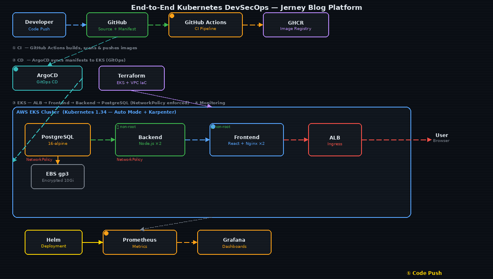

# 🚀 End-to-End Kubernetes DevSecOps — Three-Tier App Deployment

<div align="center">


**A production-grade DevSecOps project deploying the Jerney Blog Platform on AWS EKS using Terraform, Docker, Kubernetes, Helm, ArgoCD, Prometheus, Grafana, GitHub Actions**  

</div>

## ⚙️ CI/CD Pipeline



---

## 📖 Overview

This project demonstrates a complete **DevSecOps lifecycle** for the **Jerney Blog Platform** — a three-tier web application. It covers containerizing with Docker, provisioning cloud infrastructure with Terraform, deploying on Kubernetes with production-grade manifests, and automating delivery through GitHub Actions. 

The platform leverages ArgoCD to implement a GitOps delivery model, enabling automated synchronization and self-healing capabilities that keep the cluster state in perfect alignment with the Git repository. To maintain full-stack visibility, an observability suite featuring Prometheus and Grafana is integrated, providing real-time monitoring, performance dashboards, and proactive alerting to ensure the platform's reliability and security posture.

> Security is embedded at every layer — non-root containers, read-only filesystems, NetworkPolicies, encrypted EBS storage, and least-privilege IAM. 
---

## 🛠 Tech Stack

| Layer | Technology | Version |
|---|---|---|
| **Frontend** | React + Vite, Nginx | React 18, Nginx 1.27-alpine |
| **Backend** | Node.js, Express, pg | Node 20, Express 4 |
| **Database** | PostgreSQL | 16-alpine |
| **Containers** | Docker (multi-stage builds) | latest |
| **Orchestration** | Kubernetes on AWS EKS | 1.34 |
| **IaC** | Terraform (EKS Auto Mode) | v1.5+ |
| **CI/CD** | GitHub Actions | — |
| **Registry** | GitHub Container Registry | ghcr.io |
| **Ingress** | AWS ALB Controller | v2.11.0 |
| **Storage** | AWS EBS gp3 (encrypted) | 10Gi |
| **Autoscaling** | Karpenter (EKS Auto Mode) | — |
---

## ☁️ Infrastructure — Terraform

Provisions the full AWS stack using **EKS Auto Mode** — AWS manages node lifecycle, Karpenter handles scaling.

```
VPC (10.0.0.0/16)
├── Public Subnets  (x3 AZs)  → ALB, NAT Gateway
│     Tag: kubernetes.io/role/elb = 1
├── Private Subnets (x3 AZs)  → EKS worker nodes
└── Single NAT Gateway         → cost-optimised for dev

EKS Cluster (jerney-eks, v1.34)
├── EKS Auto Mode + Karpenter  → intelligent node provisioning
├── Node pools: general-purpose + system
├── KMS envelope encryption    → secrets encrypted at rest
├── Full control plane logging → API, audit, authenticator
└── OIDC provider              → IRSA pod-level AWS permissions
```
---

## 🐳 Dockerization

Both services use **multi-stage builds** — build tools and source never reach the final image.

### Backend Pipeline

```
node:20-alpine (build)  →  npm ci --only=production
        │
        ▼
node:20-alpine (prod)   →  non-root user UID 1000
                            dumb-init (PID 1 signal handling)
                            EXPOSE 5000
```

### Frontend Pipeline

```
node:20-alpine (build)  →  npm run build → /dist
        │
        ▼
nginx:1.27-alpine (prod) → serve /dist
                            non-root nginx UID 101
                            EXPOSE 8080
```

### Key Design Decisions

| Decision | Reason |
|---|---|
| `strategy: Recreate` on DB | RWO volumes attach to one node only |
| `initContainer` on Backend | Waits for DB:5432 before app starts |
| All services `ClusterIP` | ALB Ingress is the single external entry point |
| Numeric file prefixes (`01-`, `02-`) | Enforces correct apply order |
| `automountServiceAccountToken: false` | Pods don't need K8s API access |
| Karpenter tolerations | Graceful handling of node disruption |

---

## 🔒 Security

Security applied at **every layer** — container, network, storage, and IAM.

### Container Security Context

| | Frontend | Backend | Database |
|---|---|---|---|
| Non-root user | ✅ UID 101 | ✅ UID 1000 | ⚠️ root for initdb |
| Read-only filesystem | ✅ | ✅ | ❌ needs writes |
| No privilege escalation | ✅ | ✅ | ✅ |
| Drop ALL capabilities | ✅ | ✅ | — |
| No SA token automount | ✅ | ✅ | ✅ |

### Network Isolation

```
✅ DB accepts traffic ONLY from backend pods   (port 5432)
✅ Backend accepts traffic ONLY from frontend  (port 5000)
✅ Zero direct external access to backend or DB
✅ All services ClusterIP — no public exposure
```

### Storage

```
✅ EBS gp3: encrypted = "true"    → AES-256 encryption at rest
✅ ReclaimPolicy: Retain           → data persists beyond pod deletion
✅ subPath: pgdata                 → isolated PostgreSQL data directory
```

> ⚠️ **Secrets** are currently base64-encoded Kubernetes Secrets.  
> For production, upgrade to [Sealed Secrets](https://github.com/bitnami-labs/sealed-secrets) or [External Secrets Operator](https://external-secrets.io).

> 📄 ALB + OIDC + IAM setup → see [`ALB Controller.md`](./ALB%20Controller.md)

---

Images are tagged with **Git commit SHA** for full traceability and rollback:

```
ghcr.io/aakash-thakre/.../jerney-backend:40df8b2
ghcr.io/aakash-thakre/.../jerney-frontend:40df8b2
```

<div align="center">


</div>
